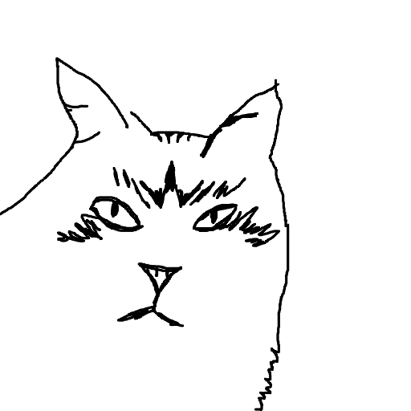

# dataset
edges were made by using [DexiNed](https://github.com/xavysp/DexiNed): https://drive.google.com/drive/folders/1qGOwLA8Ve8QkHfX5h0ezdZhjEiAYQLMT?usp=sharing

original pictures: https://drive.google.com/file/d/19mtDOC_DupDWNPnkkjGYmqQud-9Pkhu0/view?usp=sharing

# demo
to use demo you need to download [weights](https://drive.google.com/file/d/1BRLj9xc-E1J_DuP4lpQl_nLhHAv8nqpj/view?usp=sharing) and run in the terminal
```
python catify.py
```
# example


